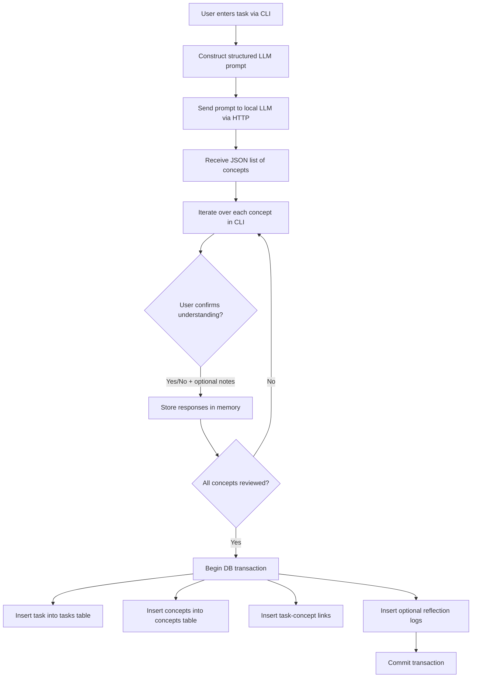

## Episteme Workflow: Task-to-Concept Mapping

This document outlines the first operational workflow in the Episteme system: taking a user-defined task, decomposing it into prerequisite concepts using a local LLM, and recording the user's knowledge status for each concept.

---

### 🧭 Step-by-Step Flow

#### 1. 📝 **User Adds a Task Prompt**

* User provides a task via the CLI (e.g., "Build a LangGraph-based planning agent").
* **Note**: The task is not yet stored in the database.

#### 2. 🤖 **Task Sent to Local LLM**

* Episteme constructs a structured prompt that asks the local LLM to decompose the task into a list of prerequisite concepts.
* The request is sent to a local LLM server (e.g., via Ollama) using HTTP.

#### 3. 📦 **LLM Returns Concepts as JSON**

* The model returns a list of concepts in a structured JSON format. Example:

```json
[
  {"name": "LangGraph state machine abstraction", "added_by": "llm"},
  {"name": "Python async workflows", "added_by": "llm"},
  {"name": "local LLM inference", "added_by": "llm"}
]
```

#### 4. ✅ **User Reviews Concepts via CLI**

* CLI displays each concept one by one, prompting:

  * Do you already understand this concept? (yes/no)
  * Optionally: write a brief reflection
* User responses are captured in memory.

#### 5. 💾 **Atomic Save to SQLite DB**

* If concept generation and review succeeds:

  * Task is inserted into the `tasks` table
  * Each concept is inserted into the `concepts` table (with `status: known/unknown` and `added_by: llm`)
  * Mappings between the task and its concepts are inserted into `task_concept_map`
  * Optional reflection logs are written to `progress_logs`
* All inserts occur in a single transaction block to ensure atomicity

---

### 💡 Design Philosophy

* Encourage structured thinking by enforcing prerequisite tracking
* Combine LLM's generative power with human confirmation
* Prevent orphaned tasks by deferring DB write until concept structure is available
* Ensure all state changes are persistently logged for auditability

---

### 🔜 Future Enhancements

* Editable intermediate output before saving (via Streamlit UI)
* Confidence scoring or auto-mastery estimation from user behavior
* LLM retries or ensemble comparison for better decomposition quality



